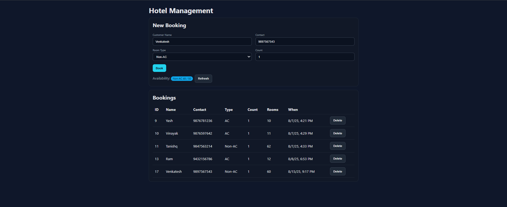

# HOTEL MANAGEMENT SYSTEM

A simple hotel booking system with a **Spring Boot** backend and an **Angular 17** frontend.

- Backend exposes REST APIs for bookings and availability
- Frontend provides a form to create bookings, list bookings, view availability, and delete bookings

---

# FEATURES

- **BOOK ROOMS:** Book AC or Non-AC rooms for customers with automatic room number assignment.
- **REAL-TIME ROOM AVAILABILITY:** Instantly see how many AC/Non-AC rooms are available.
- **VIEW ALL BOOKINGS:** Display all current bookings with customer details and assigned room numbers.
- **DELETE BOOKINGS:** Remove a customer booking and automatically update room availability.
- **PERSISTENT DATA:** All bookings and room assignments are stored in PostgreSQL for reliability.
- **RESPONSIVE WEB UI:** Simple, interactive HTML frontend for easy hotel management.

---

# TECHNOLOGIES USED

- **Java 17+**, **Spring Boot 3.2+**, **Spring Data JPA (Hibernate)**
- **PostgreSQL** (prod) and **H2** (in-memory, optional for quick dev)
- **Angular 17**, **Angular CLI**, **TypeScript**
- **Maven**

---

# DEPENDENCIES

This project uses the following Maven dependencies (see `pom.xml`):

```xml
<dependency>
    <groupId>org.springframework.boot</groupId>
    <artifactId>spring-boot-starter-web</artifactId>
</dependency>
<dependency>
    <groupId>org.springframework.boot</groupId>
    <artifactId>spring-boot-starter-data-jpa</artifactId>
</dependency>
<dependency>
    <groupId>org.postgresql</groupId>
    <artifactId>postgresql</artifactId>
    <scope>runtime</scope>
</dependency>
<dependency>
    <groupId>org.springframework.boot</groupId>
    <artifactId>spring-boot-starter-thymeleaf</artifactId>
</dependency>
```

---

## Backend configuration

`src/main/resources/application.properties` is set for PostgreSQL:

```properties
spring.datasource.url=jdbc:postgresql://localhost:5432/hotel_db
spring.datasource.username=postgres
spring.datasource.password=YOUR_PASSWORD
spring.jpa.hibernate.ddl-auto=update
spring.jpa.show-sql=true
server.port=8080
```

---

# PREREQUISITES

- Java 17+
- Maven
- Node.js 20 LTS + npm
- PostgreSQL (if not using H2)

---

# DATABASE SETUP

Create a PostgreSQL database named `hotel_db`:

```sql
CREATE DATABASE hotel_db;
```
Update DB credentials in `application.properties`.

---

## Project structure (key parts)

```bash
Hotel Angular/
├── src/main/java/com/example/Hotel/
│   ├── Booking.java
│   ├── BookingController.java
│   ├── BookingRepository.java
│   ├── BookingService.java
│   └── HotelApplication.java
├── src/main/resources/
│   └── application.properties
└── hotel-frontend/
    ├── angular.json
    ├── package.json
    ├── proxy.conf.json
    └── src/
        ├── main.ts
        ├── styles.css
        └── app/
            ├── app.component.ts
            ├── app.routes.ts
            ├── models/booking.model.ts
            ├── services/hotel.service.ts
            └── pages/bookings-page.component.ts
```

---

## How to run (Windows PowerShell)

1) Install Node.js 20 LTS (if not installed)
```powershell
winget install OpenJS.NodeJS.LTS --silent --accept-package-agreements --accept-source-agreements
```

2) Allow running npm/npx scripts once per user (fixes execution policy error)
```powershell
Set-ExecutionPolicy -ExecutionPolicy RemoteSigned -Scope CurrentUser
```

3) Start the backend (Spring Boot)
```powershell
cd "F:\Hotel Angular"
.\mvnw.cmd spring-boot:run
```

4) Start the frontend (Angular)
```powershell
cd "F:\Hotel Angular\hotel-frontend"
npm install
ng serve --open
```

---

## API Endpoints

- `POST /api/hotel_db/bookings` — Book rooms (JSON: customerName, contact, roomType, count)
- `GET /api/hotel_db/bookings` — List all bookings
- `DELETE /api/hotel_db/bookings?id={bookingId}` — Delete a booking by ID
- `GET /api/hotel_db/rooms/availability?type=AC|Non-AC` — Get room availability

---
# CONTACT

- **Developer:** *Venkatesh Soma*
- **Email:** venkateshsoma2305@gmail.com
- **GitHub:** *venkatesh-soma* 

---

# SCREENSHOT

 

